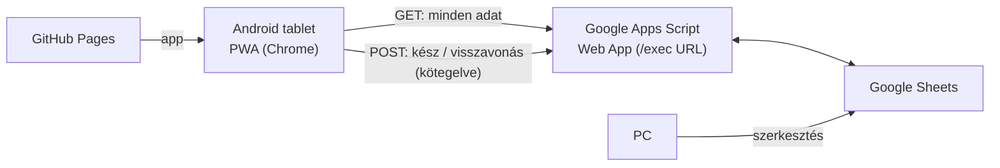

# 🦖🚒 Napi Rutin – végleges terv

Játékos, képes napi rutin app **több gyereknek**. **Android tableten** fut Chrome-ból, telepített appként (PWA). Az adatok egy **Google Sheets** táblázatban vannak, amit PC-ről szerkesztesz.

## ✅ Döntések

| Téma | Döntés |
|---|---|
| Adattárolás | Google Sheets + Apps Script (a táblázat az admin felület) |
| Felhasználók | **Több gyerek**, egy közös tablet, a kezdőképernyőn **nagy avatarokkal** lehet gyereket választani |
| Listák | Közösek. **Feladatonként és listánként** megadható, kinek szól (üres = mindenkinek). Típusok: napszak, alkalmi; a hét napjai szerint szűrhetők. |
| Téma | Járművek 🚒 / dinók 🦖. **Gyerekenként** beállítható; alapból `auto` = naponta váltakozik. Listánként felülírható. |
| Matricák | **Listánként külön matrica**, így egy napra több is juthat (🌞 reggel, 🌙 este…) |
| Hang | Gépi magyar felolvasás, de feladatonként **saját hangfájl** is megadható |
| Hangeffektek | Igen (sziréna, dínóbőgés, fanfár), **szülői módban némíthatók** |
| Hosztolás | GitHub Pages (GitHub Actions automatikus telepítéssel) |
| Napváltás | **Hajnali 4-kor** (a `Beallitasok` lapon módosítható) |
| Képek | Vegyesen: Drive link, bármilyen URL, az app saját `kepek/` mappája, vagy emoji |

---

## 1. Architektúra

- **Frontend:** Vite + sima JavaScript (nincs keretrendszer), csak CSS animációk, a hangeffektek WebAudióval előállítva (nincs hangfájl-függőség)
- **Kapcsolat beállítása az appban:** első induláskor meg kell adni az Apps Script URL-t és a **családi kódot**. Ezek csak a tableten tárolódnak, a GitHub repóba nem kerülnek. Van **Demó mód** is beépített próbaadatokkal.
- **Offline-tűrés:** az adatok gyorsítótárban vannak, az elvégzett feladatok sorba állnak és később szinkronizálódnak. Közben a felület azonnal reagál.
- **Apps Script `setup()` függvény:** egy kattintással létrehozza a lapokat fejlécekkel és mintaadatokkal

---

## 2. Adatmodell (táblázatlapok)

### `Gyerekek`
| id | nev | avatar | tema | sorrend | aktiv |
|---|---|---|---|---|---|
| bence | Bence | 🦁 *(vagy kép URL)* | auto | 1 | igen |

### `Listak`
| id | nev | tipus | kezdes | vege | napok | kinek | ikon | tema | sorrend | aktiv |
|---|---|---|---|---|---|---|---|---|---|---|
| reggel | Reggel | napszak | 06:00 | 10:00 | minden | | 🌞 | | 1 | igen |
| ovi | Oviba indulás | alkalmi | | | hétköznap | bence | 🎒 | jarmu | 10 | igen |

### `Feladatok`
| id | lista_id | sorrend | cim | kep | emoji | napok | kinek | felolvasas | hang | aktiv |
|---|---|---|---|---|---|---|---|---|---|---|
| f1 | reggel | 1 | Fogmosás | *(link)* | 🪥 | minden | | Most mossunk fogat! | | igen |

- `napok`: `minden`, `hétköznap`, `hétvége`, vagy felsorolás: `H,K,Sze,Cs,P,Szo,V`
- `kinek`: gyerek id-k vagy nevek vesszővel; üres = mindenkinek
- `hang`: saját hangfájl URL-je; ha üres, gépi felolvasás jön (`felolvasas`, ennek hiányában `cim`)

### `Elvegzett` (ezt az app írja)
| datum | gyerek_id | lista_id | feladat_id | idopont |
|---|---|---|---|---|

### `Beallitasok`
| kulcs | ertek |
|---|---|
| nap_kezdete | 4 |
| hangeffektek | igen |
| felolvasas_sebesseg | 0.9 |

---

## 3. Képernyők

1. **Kapcsolat** (csak első induláskor): Apps Script URL + családi kód, vagy Demó mód
2. **Ki vagy?** Nagy avatarkártyák a gyerekekkel
3. **Gyerek kezdőképernyő:** az aktuális napszak listája óriás kártyán, a többi mai lista kisebb kártyákon, haladással (pl. 3/5), és a heti matricatábla
4. **Lista nézet:** óriás képkártyák. Bökésre felolvasás, a nagy **„Kész!”** gombra hangeffekt és matricává fordulás. Alul a haladásjelző pálya (🚒 → 🏁 vagy 🦖 → 🥚), a végén konfetti és a matrica „beragasztása”.
5. **Heti matricatábla:** H–V napok, listánként egy matrica
6. **Szülői mód** (a 🔒 ikon **3 mp-es nyomva tartása**): visszavonás a kártyákon, hangeffektek némítása, adatok frissítése, szinkron állapota, kapcsolat beállítása

---

## 4. Fejlesztési lépések

1. Projektváz (Vite, PWA manifest, service worker, ikonok)
2. Logika (napkulcs 4 órás határral, szűrés napra és gyerekre, téma, matricák) + Demó adatréteg
3. Képernyők + stílusok + animációk + hang
4. Apps Script (`Code.gs`) + Google adatréteg + offline sor
5. Beállítási útmutató (`README.md`) + GitHub Actions deploy
6. Ellenőrzés böngészőben, tablet felbontáson
